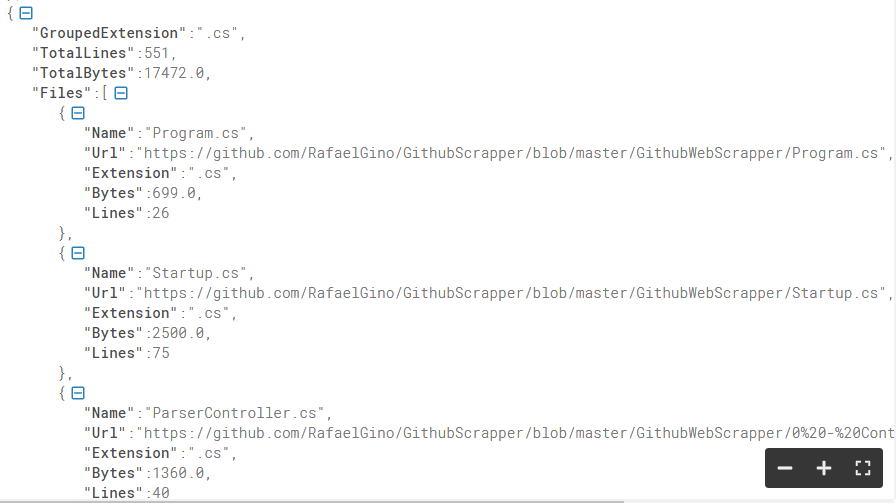
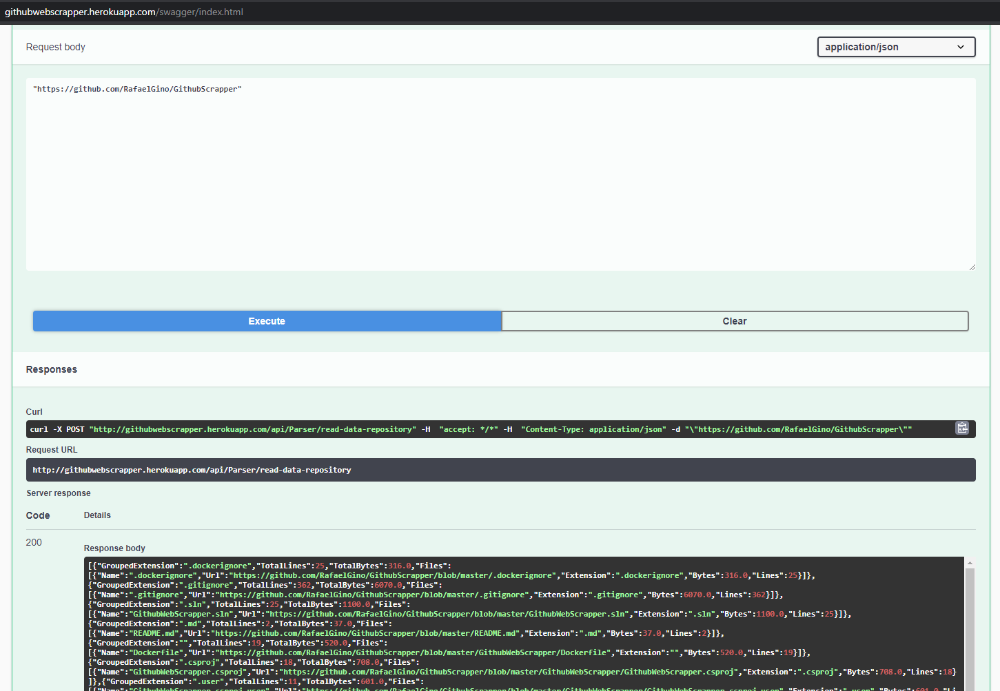

# Hi, I'm Rafael 
*I built this API using .NET Core focusing on performance without using a third party library to manipulate the HTML.*

The app was deployed using a docker container at [Heroku](http://githubwebscrapper.herokuapp.com/swagger/index.html) using [Heroku CLI](https://devcenter.heroku.com/articles/heroku-cli).

I avoided using regex as much as possible.

I used only native classes to download and analyze the github html.

I created the API method as a `Post` since the is data processing for return in a specific format.

As I used Swagger and Swagger UI for documentation, the API method is self-explanatory.

The project could have used dependency injection, a number of other design patterns and even better approaches to analyzing html, but within my available time it was what I managed to do.

Returned Json:

Swagger:

